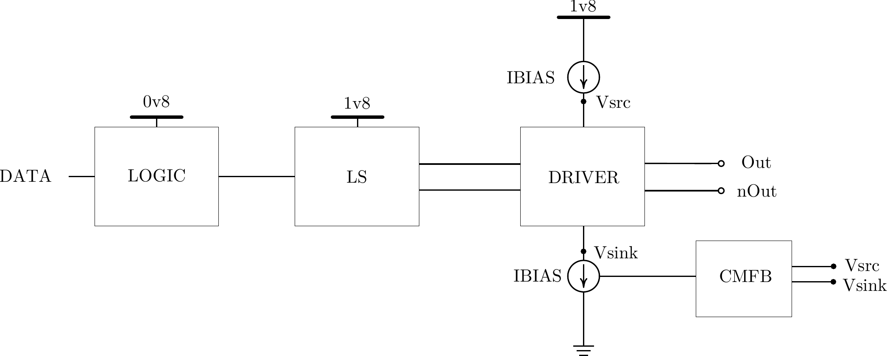
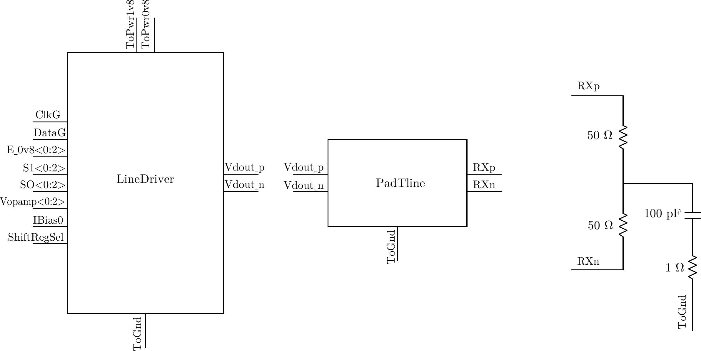
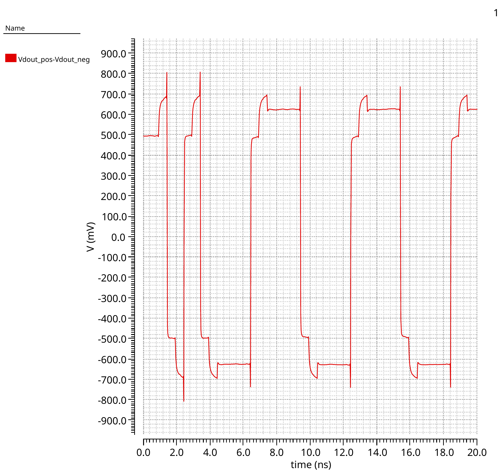
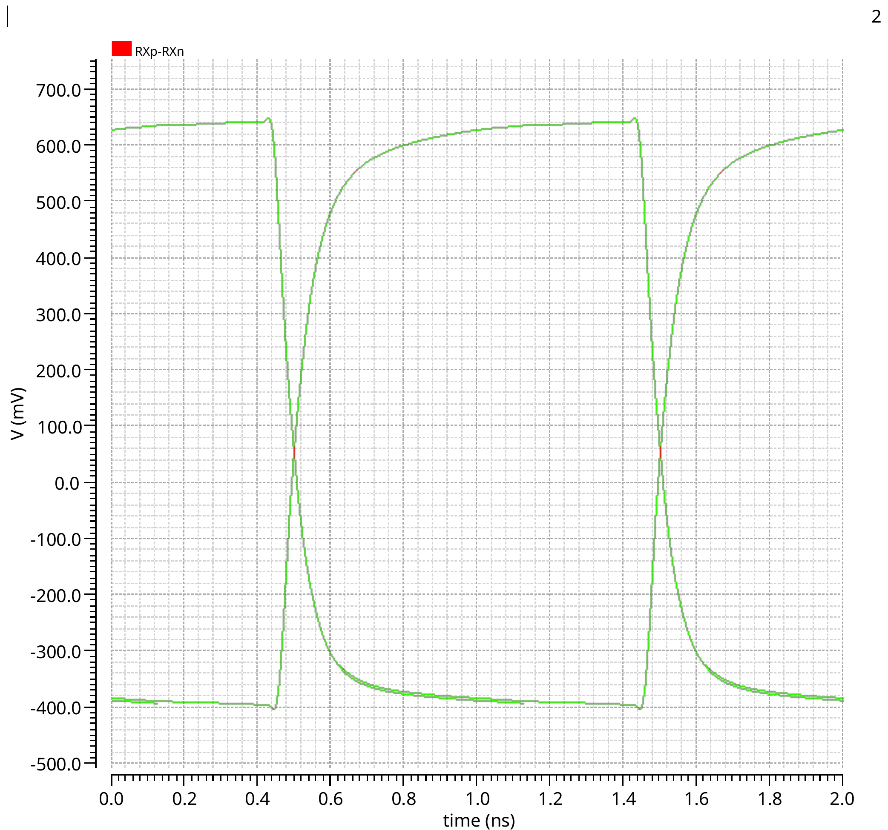
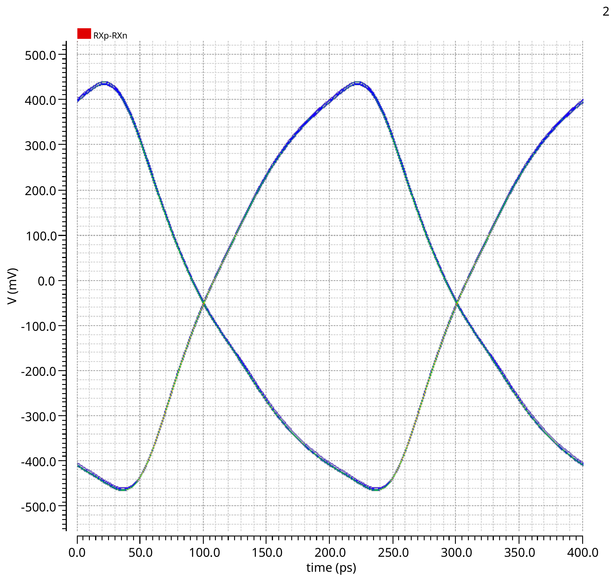
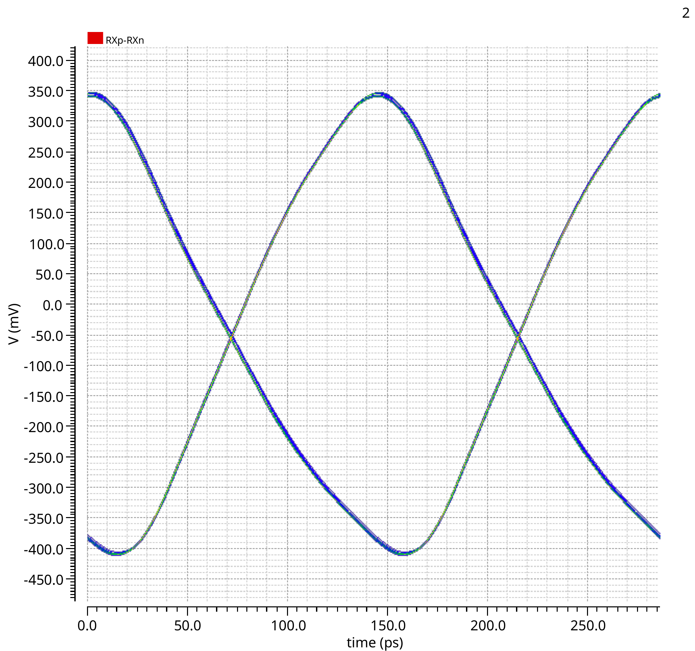
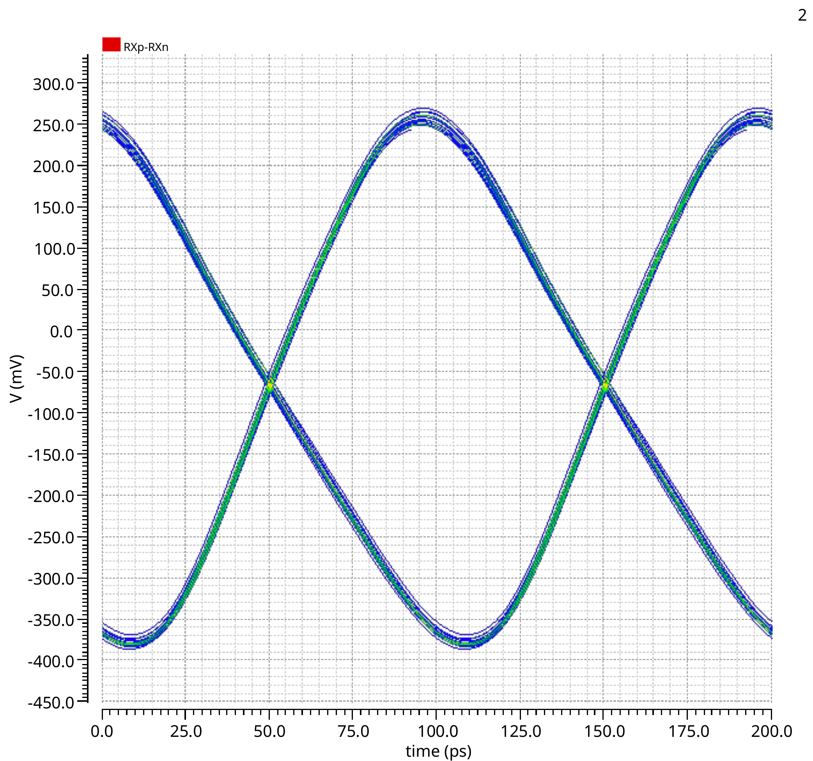

# GF22nm FD-SOI SerDes Transmitter

**Bachelor's Thesis Technical Portfolio**  
**Universitat Autònoma de Barcelona (UAB) · IMB-CNM, CSIC**  
**July 2026 · Grade: 9.5/10**

## Overview

This project presents the transistor-level design and circuit-level verification of a high-speed differential SerDes transmitter implemented in GF22nm FD-SOI technology.

The transmitter combines a **Push-Pull Current-Mode Logic (PPCML)** output stage with a configurable **three-tap feed-forward equalizer (FFE)**. The complete architecture also includes biasing circuitry, 0.8 V-to-1.8 V level shifters, common-mode feedback (CMFB), modified TSPC-based control logic and power-down functionality.

The circuit was designed using **Cadence Virtuoso** and verified using **Cadence Spectre**.

## Key Features

| Parameter | Description |
|---|---|
| Technology | GF22nm FD-SOI |
| Design environment | Cadence Virtuoso |
| Simulator | Cadence Spectre |
| Output architecture | Differential PPCML |
| Equalization | Configurable three-tap FFE |
| Voltage domains | 0.8 V / 1.8 V |
| Main cursor current | 6.0 mA |
| Post-cursor currents | 1.2 mA / 0.5 mA |
| Evaluated data rates | 1, 5, 7 and 10 Gb/s |
| Verification stage | Nominal pre-layout |

## Transmitter Architecture

The transmitter consists of:

- Biasing network for the PPCML branches
- Three parallel PPCML output drivers
- 0.8 V-to-1.8 V level shifters
- Common-mode feedback circuitry
- Modified TSPC-based high-speed control logic
- Configurable three-tap FFE
- Distributed power-down control

The three PPCML branches implement the main cursor and two post-cursors, with their differential currents combined at the transmitter output.

## Verification Methodology

Verification was performed at both block and top level using Cadence Spectre.

The complete simulation environment included a differential transmission-line model and 50-ohm terminations. Functional and transient simulations were used to verify the control logic, voltage-domain conversion and differential output stage.

Eye diagrams were evaluated at **1, 5, 7 and 10 Gb/s** under nominal pre-layout conditions.

## Results

The simulations verified correct operation of the complete transmitter architecture across the evaluated data rates.

As the data rate increased, the available timing margin and output amplitude decreased due to the finite bandwidth of the transmitter and transmission path. An observable eye opening was maintained at **10 Gb/s** under the nominal pre-layout conditions evaluated in this work.

The configurable de-emphasis functionality was also verified at the transmitter output by combining the main cursor with independently configurable post-cursor branches.

### Configurable de-emphasis

The different output levels confirm the functional contribution of the main cursor and the independently configurable post-cursor branches.

> The de-emphasis verification demonstrates functional generation of the equalized waveform. No claim is made regarding compliance with a specific communication standard or optimum equalization for a particular channel.

### Eye-diagram evolution

| 1 Gb/s | 5 Gb/s |
|---|---|
|  |  |

| 7 Gb/s | 10 Gb/s |
|---|---|
|  |  |

## Future Work

The current results correspond to nominal pre-layout simulations. Possible extensions include:

- Physical layout
- Design Rule Check (DRC)
- Layout Versus Schematic (LVS)
- Parasitic extraction
- Post-layout simulation
- Process, Voltage and Temperature (PVT) analysis
- Monte Carlo analysis
- FFE optimization for representative transmission channels

## Disclaimer

This repository is intended as a technical portfolio.

It does **not** include proprietary PDK files, device models, technology files, netlists, Cadence databases or other confidential design data.
